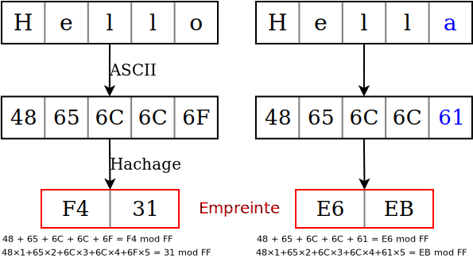

# Présentation du projet

## Étapes

::: incremental

1. Récupération d'archive `zip` sur serveur Web distant
2. Décompression → dump SQL
3. Vérification de changements
4. Compression en `tgz`
5. Envoi sur serveur d'archivage SSH en SFTP

:::

***

### En parallèle

- Suppression sauvegardes trop anciennes
- Écriture logs et envoi de mail

# Fonctionnalités attendues

## Vérification de modifications

:::: {.columns}
::: {.column width="50%"}
Utilisation de checksum sur 256 bits

Très faible probabilité de collisions
:::
::: {.column width="50%"}
{ width=100% }
:::
::::

::: notes

**Antoine**

:::

## Serveur

Sur Raspberry Pi 4

:::: {.columns}
::: {.column width="40%"}
### Web

Serveur Apache  
port 80 (`http`) ou 443 (`https`)
:::
::: {.column width="20%"}
{ width=100% }
:::
::: {.column width="40%"}
### SSH

Port 22

Suppression anciennes sauvegardes

Connexion avec paire de clés RSA
:::
::::

::: notes

**Justin**

Serveur SSH utlise le protocole SFTP pour transférer des fichiers

Clés RSA permet exécution autonome du script

:::

## Suivi des opérations

:::: {.columns}
::: {.column width="50%"}
### Écriture de logs

{ width=100px }

Spécifications selon erreurs possibles

:::
:::{.column width="50%"}
### Envoi de mails

{ width=100px }

Avec Mutt, via serveur SMTP externe (Zoho Mail)
:::
::::

## Automatisation

Utilisation de **Cron** (`crontab -e`{.bash}) :

```
0 4 * * * /path/to/archive.sh
```

Exemple avec `fcron` :

```
&bootrun(true) 0 4 * * * /path/to/archive.sh
```

::: notes

**Justin**

Utilisateur a l'autorisation d'exécution sur `archive.sh`

Membre du groupe `cron`

Utilisation de `fcron` si machine potentiellement éteinte à l'heure spécifiée

:::

# Solution technique

## Choix du langage

### GNU Bash

::::{.columns}
:::{.column width=40%}
{width=100%}
:::
:::{.column width=60%}
- Clair et concis
- Intégré aux GNU/Linux
- Intégrable autres systèmes, Unix ou non
- Pas besoin des capacités de Python
:::
::::


::: notes

Intégrable autres systèmes :

- Unix : MacOS, *BSD
- Windows (pénible)

Python est un langage multiparadigme, ici besoin uniquement de script

Pas besoin d'installer des bibliothèques particulières

Possibilité d'utiliser directement les commandes du système, beaucoup plus lisible

:::

## Fichiers

```
.
|-  archive.sh      # Script bash
|-  archive.conf    # Fichier de configuration
|-  archive.log     # Logs du script
|-  .prevChecksum   # Somme de contrôle du précédent fichier
```

## Fonctions du script

:::::{.columns}
::::{.column width=50%}

### Arguments

`$1`{.bash} 
:   Si succès, `0`
:   Si échec, `1`

`$2`{.bash}
:   Si succès, checksum
:   Si échec, raison
::::
::::{.column width=50%}

### Fonctions

- `ecrireLog $1 $2`{.bash}
- `envoyerMail $1 $2`{.bash}
- `combo $1 $2`{.bash}

::::
:::::

## Organisation du script

Pour gérer toutes les erreurs :

```bash
if ! commande; then
	combo 1 "L'opération a échouée à cause de \`commande\`."
	exit 1
fi
```

## Organisation de la config

- Configuration générale
- Configuration du serveur SSH
- Configuration des mails + serveur SMTP

***

### Configuration générale

`emplacementLog=./archive.log`{.bash}
:   Définit où les logs sont enregistrés.

`logStdout=0`{.bash}
:   En cas d'échec, redirige le motif à la sortie standard (`0`) ou pas (`1`).

`archiveURL`
:   Définit l'emplacement de l'archive via une URL.

***

### Serveur d'archivage

`adresseArchivage`
:   Adresse IP du serveur d'archivage.

`usernameSSH`
:   Nom d'utilisateur à utiliser.

`pathSSH`
:   Chemin sur lequel enregistrer les archives.

`dureeConservation=30`{.bash}
:   Durée de conservation des archives, en jours.

***

### Envoi de mails

`envoyerMail=1`{.bash}
:   Jamais (`0`), en cas d'échec (`1`) ou toujours (`2`).

`mailDestinataires=(dest1@mail.org)`{.bash}
:   Destinataires du mail.

`objSucces` et `objEchec`
:   Objet du mail en cas de succès/échec.

`joindreLog=1`{.bash}
:   Comme `$envoyerMail`{.bash}

`muttrcUtilisateur=1`{.bash}
:   Utiliser le `~/.muttrc` utilisateur (`0`) ou non (`1`).

***

#### Serveur SMTP

Uniquement si `muttrcUtilisateur=1`.

`serveurHote`
:   Serveur SMTP qui gère l'envoi de mails.

`port`
:   Port sur lequel contacter le serveur.

`mailEnvoyeur` et `motDePasse`
:   Pour s'identifier sur `serveurHote`.


# Démonstration

## Test normal

## Test avec fichier identique

## Test avec serveur d'archivage inaccessible

# Conclusion

Solution fonctionnelle, qui considère tous les cas de figures

Amélioration : ne pas stocker le mot de passe mail en clair (voir GnuPG)

## Merci de votre attention ! ^^

{ height=80% }

# Annexes

## Dépendances

::::{ .columns }
:::{.column width=50%}
### Ordinateur client

- `GNU coreutils`
- `wget`
- `unzip`
- `tar`
- `OpenSSH` en client
- `mutt`

:::
:::{.column width=50%}
### Serveur d'archivage

- `GNU coreutils`
- `GNU findutils`
- `OpenSSH` en serveur
:::
::::

## Utiliser Mutt

Pour envoyer via SMTP, options avec `-e` (`from`, `smtp_pass`, `smtp_url`, `send_charset`) :

```bash
echo "message" | mutt -nx \
                      -e "set [options] = \"[valeur]\"" \
					  -s "Objet" \
					  -a $emplacementLog -- \
					  "$(echo ${mailDestinataires[*]})"
```

## Fonctions

### `ecrireLog`

```bash
function ecrireLog() {
    if [[ $1 -eq 0 ]]; then
		echo "[ $(date +'%T - %d %b %Y') ] : Succès, checksum=$2" >> "$emplacementLog"
    else
		[[ $logStdout -eq 0 ]] && echo "$2"
		echo "[ $(date +'%T - %d %b %Y') ] : Échec, $2" >> "$emplacementLog"
    fi
}
```

***

### `envoyerMail`

```bash
function envoyerMail() {
    if [[ ${#mailDestinataires[*]} -ne 0 && (($1 -eq 1 && $envoyerMail -eq 1) || $envoyerMail -eq 2) ]]; then

	if [[ $muttrcUtilisateur -eq 0 ]]; then
	    echo "$([[ $1 -eq 0 ]] && echo L\'opération de ce jour est un succès || echo $2)" | \
		mutt -x \
		     -s "$([[ $1 -eq 0 ]] && echo $objSucces || echo $objEchec)" \
		     $([[ $joindreLog -eq 2 || ($1 -eq 1 && $joindreLog -eq 1) ]] && echo "-a $emplacementLog --") \
		     "$(echo ${mailDestinataires[*]})"

	else
	    echo "$([[ $1 -eq 0 ]] && echo L\'opération d\'archivage de ce jour est un succès. || echo $2)" | \
		mutt -nx \
		     -e "set from = \"$mailEnvoyeur\"" \
		     -e "set smtp_pass = \"$motDePasse\"" \
		     -e "set smtp_url = \"smtps://$mailEnvoyeur@$serveurHote:$port\"" \
		     -e "set send_charset = \"utf-8\"" \
		     -s "$([[ $1 -eq 0 ]] && echo $objSucces || echo $objEchec)" \
		     $([[ $joindreLog -eq 2 || ($1 -eq 1 && $joindreLog -eq 1) ]] && echo "-a $emplacementLog --") \
		     "$(echo ${mailDestinataires[*]})"
	fi
    fi

    [[ $? -ne 0 ]] && ecrireLog 1 "erreur lors de l'envoi du mail."
}
```
