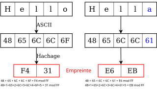

# Solution technique

::: incremental

1. Récupération de l'archive `zip` sur serveur Web distant
2. Décompression de l'archive → dump SQL
3. Vérification de changements
4. Compression en `tgz`
5. Envoi sur serveur d'archivage

:::

***

## En parallèle

- Suppression des sauvegardes trop anciennes
- Écriture de logs et envoi de mails

# Présentation de la structure

## Fichiers

```
.
|-  archive.sh      # Script
|-  archive.conf    # Fichier de configuration
|-  archive.log     # Logs du script
|-  .prevChecksum   # Somme de contrôle du précédent fichier
```

## Organisation du script

3 fonctions pour une lisibilité accrues :

::: incremental

- `ecrireLog $1 $2`{.bash} : `$1` correspond au succès ou à l'échec de l'opération, `$2` correspond à la somme de contrôle du fichier ou au motif de l'erreur
- `envoyerMail $1 $2`{.bash} : `$2` correspond au corps du message en cas d'échec
- `combo $1 $2`{.bash} : combine les deux fonctions précédentes

:::

## Organisation de la config

- Configuration générale
- Configuration du serveur SSH
- Configuration des mails + serveur SMTP

# Réalisation des fonctionnalités demandées

## Vérification de modifications

:::: {.columns}
::: {.column width="50%"}
Utilisation de checksum sur 256 bits

Très faible probabilité de collisions
:::
::: {.column width="50%"}

:::
::::

## Serveur

Sur Raspberry Pi 4

:::: {.columns}
::: {.column width="40%"}
### Web

Avec Apache, port 80 (http) ou 443 (https)
:::
::: {.column width="20%"}

:::
::: {.column width="40%"}
### SSH

Port 22

Suppression des anciennes sauvegardes
:::
::::

::: notes

Serveur SSH utlise le protocole SFTP pour transférer des fichiers

:::

## Suivi des opérations

:::: {.columns}
::: {.column width="50%"}
### Écriture de logs

Spécifications selon cas d'erreurs possibles

:::
:::{.column width="50%"}
### Envoi de mails

Avec Mutt, via serveur SMTP externe (Zoho Mail)
:::
::::

## Automatisation

Utilisation de Cron

```
0 4 * * * /path/to/archive.sh
```

::: notes

Utilisateur a l'autorisation d'exécution sur `archive.sh`

Membre du groupe `cron`

Utilisation de `fcron` si machine potentiellement éteinte à l'heure spécifiée (à voir)

:::

# Démonstration

## Test normal

## Test avec fichier identique

## Test avec serveur d'archivage inaccessible

