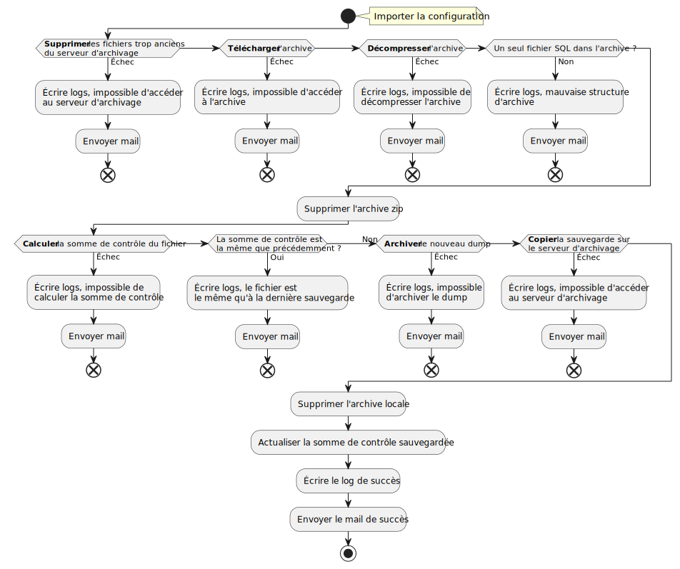

\newpage
# Utilisation des variables

# Organisation

## Fichiers

On a l'organisation suivante pour les fichiers :

```
.
|- archive.sh      # Script
|- archive.conf    # Fichier de configuration
|- archive.log     # Logs du script, possibilité de modifier l'emplacement
|- .prevChecksum   # Somme de contrôle du précédent fichier
```

## Script

# Principe de fonctionnement

<!--Ça peut être cool si on fait un schéma propre avec PlantUML pour montrer les connexions et interactions entre serveurs-->



# Justification des choix techniques

## Envoi de mails

Pour configurer l'envoi des mails, on utilise mutt :

- `mailutils` ou `mutt` : pour l'interaction avec l'utilisateur, envoyer et lire des mail

## Serveur Web

