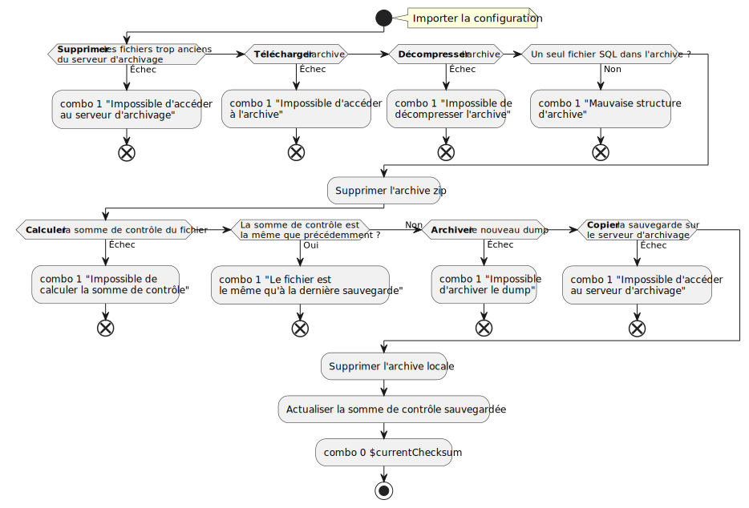

<!--Lien par références :-->
[`mutt`]: http://www.mutt.org/

\newpage
# Utilisation des variables

## Variables du fichier de configuration

Le fichier de configuration `archive.conf` comprend les variables suivantes :

### Configuration générale

`emplacementLog`
:   Définit où les logs sont enregistrés. Attention, l'utilisateur qui exécute le script doit avoir les droits d'écriture dans le dossier parent.

    Par défaut sur `./archive.log`.

`logStdout`
:   En cas d'échec, redirige le motif à la sortie standard (`0`) ou pas (`1`).

    Par défaut sur `0`.

`archiveURL`
:   Définit l'emplacement de l'archive via une URL, accessible depuis l'ordinateur client.

### Serveur d'archivage

`adresseArchivage`
:   Adresse IP du serveur d'archivage, qui doit être accessible via SSH. Si le port 22 est utilisé, pas besoin de le préciser.

`usernameSSH`
:   Nom d'utilisateur à utiliser sur le serveur d'archivage

`pathSSH`
:   Chemin sur lequel enregistrer les archives sur le serveur. Le chemin doit déjà exister et être accessible en lecture et écriture pour l'utilisateur renseigné à `usernameSSH`.

`dureeConservation`
:   Durée à partir de laquelle les anciennes archives seront supprimées, en jours.

    Par défaut sur `30`.

### Envoi de mails

`envoyerMail`
:   Dans quel cas envoyer un mail, jamais (`0`), en cas d'échec de l'exécution (`1`) ou toujours (`2`).

    Par défaut sur `1`.

`mailDestinataires=(dest1@mail.org dest2@mail.org)`
:   Destinataires du mail, séparés par des espaces. Si cette liste est vide, et peut importe la valeur de `envoyerMail`, le programme quittera sans envoyer de mail et sans erreur.

`objSucces`
:   Objet du mail à envoyer en cas de succès.

    Par défaut sur `Archivage du $(date +'%d %B %Y') réussi`.

`objEchec`
:   Objet du mail à envoyer en cas d'échec.

    Par défaut sur `Archivage du $(date +'%d %B %Y') échoué`.

`joindreLog`
:   Dans quelle situation joindre le fichier de logs complet, jamais (`0`), en cas d'échec (`1`) ou toujours (`2`).  
    Attention, il s'agit du fichier de log entier, le motif d'échec, si c'est le cas, est toujours indiqué dans le corps du message.
	
	Par défaut sur `1`

`muttrcUtilisateur`
:   Utiliser le `~/.muttrc` de l'utilisateur (`0`) ou non (`1`).

    Par défaut sur `1`.

#### Serveur SMTP

Ces options n'auront aucune incidence si `muttrcUtilisateur=0`.

`serveurHote`
:   Serveur SMTP qui gère l'envoi de mails.

`port`
:   Port sur lequel contacter le serveur. En général, on a :

    - `25` : sans chiffrement
	- `465` : chiffrement implicite (TLS/SSL)
	- `587` : chiffrement explicite (STARTTLS)

`mailEnvoyeur`
:   Mail envoyeur des informations de l'utilitaire, enregistré sur le serveur renseigné dans `serveurHote`.

`motDePasse`
:   Mot de passe associé au mail pour s'identifier sur `serveurHote`.

## Variable utilisée dans le script

Toutes les variables du fichier de configuration sont utilisées dans le script. On ne définit qu'une variable dans le script, comme tel :

```bash
currentChecksum=$(sha256sum ./*.sql | cut -d ' ' -f1)
```

Cela permet de stocker la somme de contrôle du dump SQL en cours de traitement pour pouvoir la comparer avec la some de contrôle sauvegardée.

# Organisation

On a l'organisation de fichier suivante :

```
.
|-  archive.sh      # Script
|-  archive.conf    # Fichier de configuration
|-  archive.log     # Logs du script, possibilité de modifier l'emplacement
|-  .prevChecksum   # Somme de contrôle du précédent fichier
```

## Script (`archive.sh`)

Pour simplifier la lecture et l'écriture du programme, nous avons écrit une fonction pour écrire les logs, une fonction pour envoyer un mail, et une fonction qui combine les deux.

### Fonction d'écriture de logs

```bash {.numberLines}
function ecrireLog() {
    if [[ $1 -eq 0 ]]; then
	echo "[ $(date +'%T - %d %b %Y') ] : Succès, checksum=$2" >> "$emplacementLog"
    else
	[[ $logStdout -eq 0 ]] && echo "$2"
	echo "[ $(date +'%T - %d %b %Y') ] : Échec, $2" >> "$emplacementLog"
    fi
}
```

Cette fonction admet deux paramètres, le premier définit le succès ou l'échec de l'opération, le second dépend du premier :

- en cas de succès, il s'agit de la somme de contrôle du fichier SQL sauvegardé
- en cas d'échec, il s'agit du motif de l'échec

On ajoute ensuite à la fin du fichier de log la date et l'heure d'écriture, si l'opération est un succès ou non, suivi de la checksum dans le premier cas et du motif d'échec dans le second.

### Fonction d'envoi de mails

```bash {.numberLines}
function envoyerMail() {
    if [[ ${#mailDestinataires[*]} -ne 0 && (($1 -eq 1 && $envoyerMail -eq 1) \
		    || $envoyerMail -eq 2) ]]; then

	    if [[ $muttrcUtilisateur -eq 0 ]]; then
	        echo "$([[ $1 -eq 0 ]] && echo L\'opération de ce jour est un succès \
		        || echo $2)" | \
    		mutt -x \
	    	     -s "$([[ $1 -eq 0 ]] && echo $objSucces || echo $objEchec)" \
		         $([[ $joindreLog -eq 2 || ($1 -eq 1 && $joindreLog -eq 1) ]] \
			         && echo "-a $emplacementLog --") \
		         "$(echo ${mailDestinataires[*]})"

	    else
	        echo "$([[ $1 -eq 0 ]] && echo L\'opération d\'archivage de ce jour \
		        est un succès. || echo $2)" | \
		    mutt -nx \
		         -e "set from = \"$mailEnvoyeur\"" \
		         -e "set smtp_pass = \"$motDePasse\"" \
		         -e "set smtp_url = \"smtps://$mailEnvoyeur@$serveurHote:$port\"" \
		         -e "set send_charset = \"utf-8\"" \
		         -s "$([[ $1 -eq 0 ]] && echo $objSucces || echo $objEchec)" \
		         $([[ $joindreLog -eq 2 || ($1 -eq 1 && $joindreLog -eq 1) ]] \
			         && echo "-a $emplacementLog --") \
		         "$(echo ${mailDestinataires[*]})"
	    fi
    fi

    [[ $? -ne 0 ]] && ecrireLog 1 "erreur lors de l'envoi du mail."
}
```

Cette fonction admet également deux paramètres, le premier définit le succès ou l'échec de l'opération, le second, n'est utilisé qu'en cas d'échec, et contient alors le motif de celui-ci.

Le booléen utiliser par le premier `if`{.bash} permet d'envoyer un mail si la liste de destinataires du fichier de configuration n'est pas vide *et* que on est en situation d'envoyer un mail (échec et `envoyerMail=1`, ou `envoyerMail=2`).

On vérifie ensuite si l'utilisateur veut utiliser sa configuration de [`mutt`] ou non. Si ce n'est pas le cas, on précise que [`mutt`] ne doit pas utiliser le fichier de configuration de l'utilisateur (option `-n`), et on passe les paramètres nécessaires à l'envoi d'un mail en argument (option `-e "set option = \"valeur\""`) :

- `from`
  :   permet de définir l'identité de l'envoyeur. On utilise l'adresse mail renseignée dans le fichier de configuration
- `smtp_pass`
  :   le mot de passe qui permet de se connecter au serveur SMTP
- `smtp_url`
  :   Définit le serveur auquel se connecter et le protocole de connexion (`smtps` ici). On renseigne également le port de connexion définit dans la configuration.
- `send_charset`
  :   Définit l'encodage du corps du mail et des pièces jointes. On choisit `utf-8` pour pouvoir prendre en compte l'ensemble des caractères Unicode.

On définit le sujet du mail avec l'option `-s`, qui varie en fonction de l'aboutissement de l'opération (on utilise la syntaxe : `[[ succès ? ]] && oui || non`{.bash}).

Ensuite, selon les préférences de l'utilisateur, on joint ou non le fichier de log. Pour cela, on vérifie s'il faut joindre systématiquement le log, ou s'il faut le joindre en cas d'échec et que c'en est un. Si la condition est vrai, on renvoie l'option `-a` avec le chemin de log, sinon on ne renvoie rien.

Enfin, on affiche tous les éléments de la liste des destinataires.

### Fonction de combinaison

```bash {.numberLines}
function combo() {
    if [[ "$1" -eq 0 ]]; then
        ecrireLog 0 "$2"
        envoyerMail 0
    else
        ecrireLog 1 "$2"
        envoyerMail 1 "L'opération d'archivage de ce jour \
		    a échoué pour le motif suivant : $2"
    fi
}
```

Cette fonction combine simplement les deux fonctions précédentes, et permet d'unifier les motifs d'arrêts de fonctions. En premier argument, on définit le succès (`0`) ou l'échec (`1`) de l'opération. En second, on donne la checksum du fichier concerné en cas de succès, ou le motif de l'arrêt en cas d'erreur.

## Fichier de configuration (`archive.conf`)

Le fichier de configuration est organisé en plusieurs sections :

1. Configuration générale
2. Configuration du serveur d'archivage
   :   Permet de configurer la connexion à un serveur SFTP via SSH
3. Configuration des mails
   :   Permet de configurer les infos générales des mails : quand en envoyer, objets, destinataires...
   
   - Configuration serveur SMTP
     :   Permet de définir comment se connecter au serveur d'envoi SMTP spécialement pour ce script, si nécessaire

## Fichier de journaux (`archive.log`)

Le fichier de journalisation a la syntaxe suivante pour une ligne (en utilisant une version édulcorée de la syntaxe bash pour succès ou échec) :

```
[ heure - date ] : [[ Succès, checksum || Échec, cause de l'échec ]]
```

Une nouvelle entrée par ligne, en ordre décroissant d'ancienneté.

## Fichier de somme de contrôle (`.prevChecksum`)

Le fichier `.prevChecksum` n'a pas vocation à être consulté par l'utilisateur, d'où le fait qu'il soit caché. Il permet de stocker la somme de contrôle en 256 bits du dump SQL précédent, pour pouvoir déterminer si des modifications sont advenues.

# Principe de fonctionnement

<!--Ça peut être cool si on fait un schéma propre avec PlantUML pour montrer les connexions et interactions entre serveurs-->



# Justification des choix techniques

## Envoi de mails

Pour configurer l'envoi des mails, on utilise mutt :

- `mailutils` ou `mutt` : pour l'interaction avec l'utilisateur, envoyer et lire des mail

## Serveur Web

